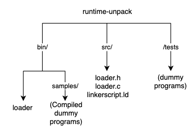
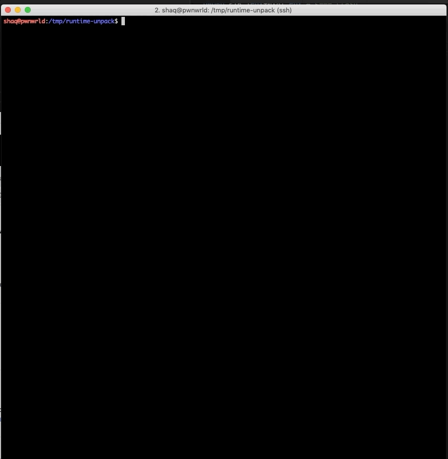
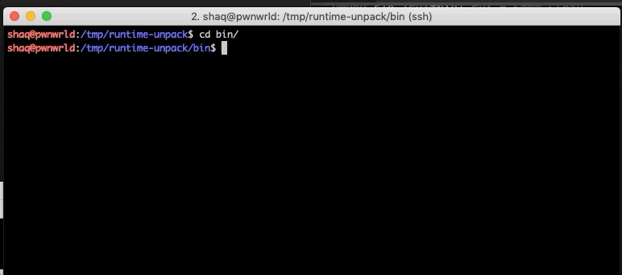
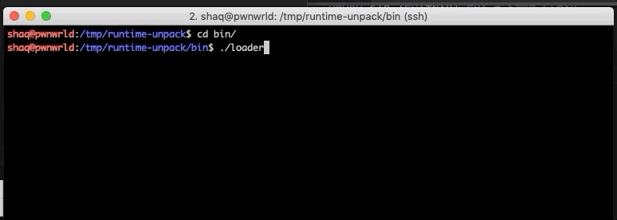

# runtime-unpack
Load a statically-linked ELF binary(x86 architecture) without the [*execve*](https://man7.org/linux/man-pages/man2/execve.2.html) syscall.

## Compiling

Build & pack using ``make``:

After compiling, you can use the ``./bin/loader`` binary to run the dummy programs in ``bin/samples/tests/*.packed``. 

The loader will unpack the elf in memory, map the segments to the right places in virtual memory, resolve symbols and [pass execution](./src/loader.c#L180) to the unpacked program's ``main()``.

sample 1 (loops, calculations and I/O):

sample 2 (system commands): 

There are more sample programs in the ``tests`` directory. 

## Notes

This is not a shiny tool but rather a tiny PoC code that will (hopefully) help beginners who are trying to learn more about the concept of packers. The loader is compiled with debug info so you can fire-up gdb and step through the C code to see how the magic is done. 

It is also a great introduction if you're a researcher who's trying to learn about [how the linux kernel loads an elf](https://elixir.bootlin.com/linux/v4.8/source/fs/binfmt_elf.c#L668) (which is **far more** complicated in reality)
